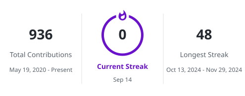

<div align="center">


<a href="https://git.io/typing-svg">
  
</a>

</div>

```
╭──────────────────────────────────────────────────╮
│ ✻ Loading Pratham Kumar's profile...             │
│                                                  │
│   /help for help, /status for your current setup │
│                                                  │
│ cwd: ~/pratham1659 · AI Engineer, Python & GenAI │
╰──────────────────────────────────────────────────╯

> who is pratham?

⏺ Pratham Kumar — AI Engineer
  Building intelligent systems with Python, LLMs & RAG.

⏺ Search(profile)
  ⎿ Stack: Python · PyTorch · LangChain · AWS · Docker
  ⎿ Status: always learning, always shipping

⏺ Done — say hi via the links below.
```

<div align="center">

### 🧠 AI / ML Stack


### ☁️ Cloud & DevOps


</div>

---

<div align="center">

<!-- GitHub Stats -->
  <picture>
    <source
      media="(prefers-color-scheme: dark)"
      srcset="https://github-stats-extended.vercel.app/api?username=pratham1659&show_icons=true&theme=tokyonight&bg_color=0D1117&title_color=FFFFFF&text_color=8B949E&icon_color=A78BFA&border_color=30363D&hide_border=true"
    />
    <source
      media="(prefers-color-scheme: light)"
      srcset="https://github-stats-extended.vercel.app/api?username=pratham1659&show_icons=true&bg_color=FFFFFF&title_color=24292F&text_color=57606A&icon_color=6A11CB&border_color=D0D7DE&hide_border=true"
  />
    
  </picture>
  
<!-- GitHub Streak -->
  <picture>
    <source
      media="(prefers-color-scheme: dark)"
      srcset="./profile/streak-dark.svg"
    />
    <source
      media="(prefers-color-scheme: light)"
      srcset="./profile/streak-light.svg"
    />
    
  </picture>

  
  <!-- Contribution Snake -->
  <picture>
    <source
      media="(prefers-color-scheme: dark)"
      srcset="https://raw.githubusercontent.com/pratham1659/pratham1659/output/github-contribution-grid-snake-dark.svg"
    />
    <source
      media="(prefers-color-scheme: light)"
      srcset="https://raw.githubusercontent.com/pratham1659/pratham1659/output/github-contribution-grid-snake-light.svg"
    />
    
  </picture>

</div>

---

<div align="center">

### 📫 Connect

<a href="mailto:prathamkumar1985@gmail.com"></a>
<a href="https://www.linkedin.com/in/pratham1659/"></a>
<a href="https://github.com/pratham1659"></a>
<a href="https://leetcode.com/u/pratham1659/"></a>
<a href="https://www.hackerrank.com/profile/pratham1659"></a>


</div>
